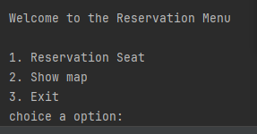
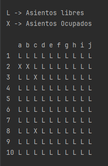

# seat-reservation
Seat reservation system for an amphitheater, developed in Java (or your preferred language), without the use of a database. All logic and data management are done internally, using in-memory data structures.

This project is ideal for practicing logic, data structures, and input/output handling without external persistence.

---

## 🛠️ Project Description

This system simulates reserving seats in an amphitheater composed of multiple rows, each containing **10 seats**. The user can:

- View the status of the seats.
- Reserve a specific seat.
- Map of available and occupied seats

The system is designed to run on a console or terminal and does not use any external storage systems (such as databases or files).

---

## ✨ Features

- ✅ Viewing seats (occupied and free)
- ✅ Reservation by row and chair number
- ✅ Availability validation
- ✅ Dynamic memory management
- ✅ Console interface

## 📸 Results

- Console menu
    

- Seating map
    
